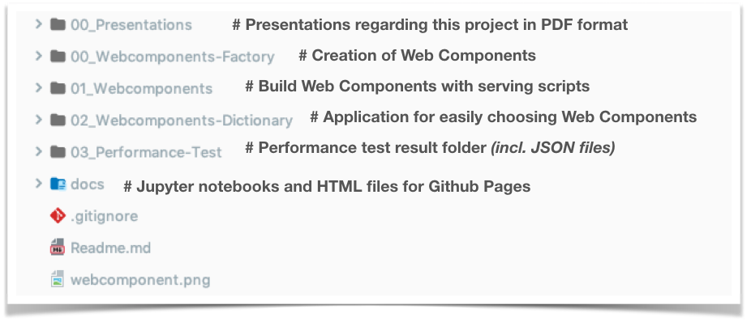

# Innovation Project on Web Components

> This project analyzes web components in terms of performance, programming convenience,
best practices and conventions.
*(Supervised by Prof. Dr. Joachim Charzinski at the
[Stuttgart Media University](https://www.hdm-stuttgart.de/)*.

---

___

The Research Project consists of three parts,
which were documented with [Jupyter Notebooks](https://jupyter-notebook.readthedocs.io/en/stable/notebook.html).
The documentation was deployed as Github pages and can be found here:
[na018.github.io/web-components_research](https://na018.github.io/web-components_research/).

## Chapter 1
The first chapter provides an introduction into Web Components and how to create them with `
Polymer`, `Angular` or `Vue`.
Two practical examples are presented: the simple Progress Bar component and the more complex Image Slider component.

## Chapter 2

The second chapter discusses how to perform performance analysis with Selenium in Python.
In this chapter the Progress Bar component is tested on performance

## Chapter 3:

The third chapter performs the performance test on the more complex Image Slider component applying the learning
gotten from the previous chapter.
Furthermore, a general evaluation of the project is presented and final thoughts discussed.

## Authors
 **Nadin-Katrin Apel**

## Acknowledgments

* Hat tip to anyone whose code was used
* Inspiration